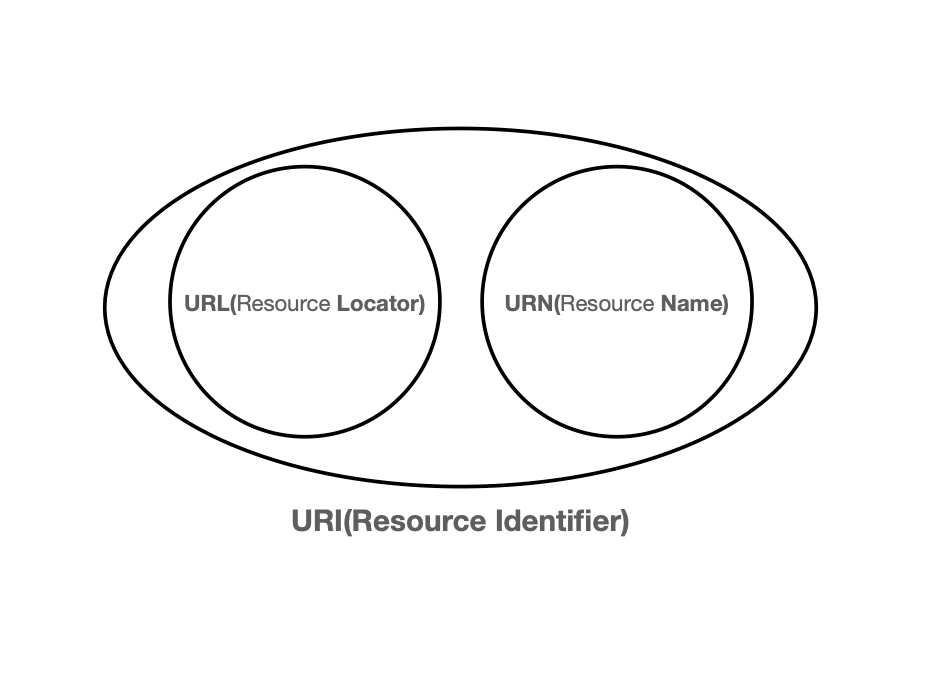
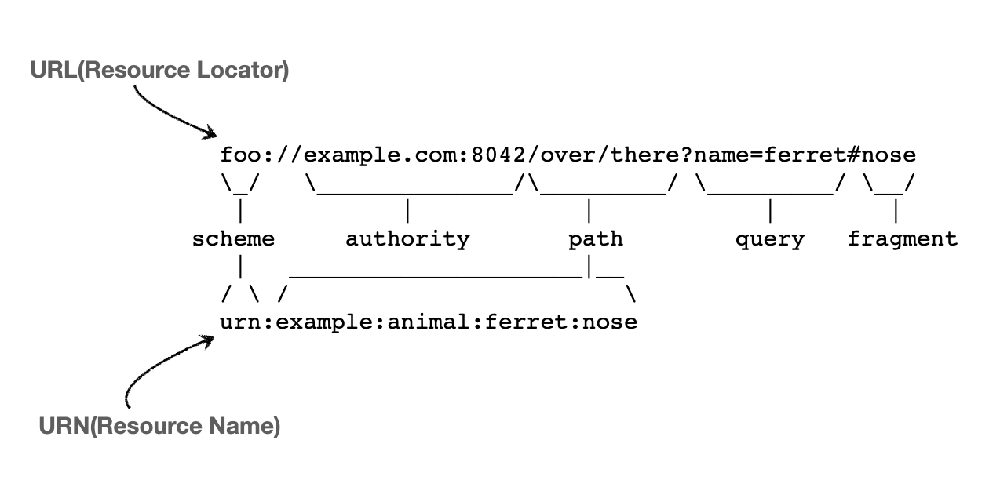

<h1>URI(Uniform Resource Identifier)</h1>
    
    
    <ul>
        <li>Uniform : 리소스 식별하는 통일된 방식</li>
        <li>Resource : 자원, URI로 식별할 수 있는 모든 것</li>
        <li>Identifier : 다른 항목과 구분하는데 필요한 정보</li>
    </ul>
    
URL - Locator : 리소스가 있는 위치 지정

    
https://www.google.com/search?q=hello&hl=ko

    
    
scheme : 주로 프로토콜
 
    
URN - Name : 리소스에 이름을 부여

    <h1>웹 브라우저 요청 흐름</h1>
    
    
    
    