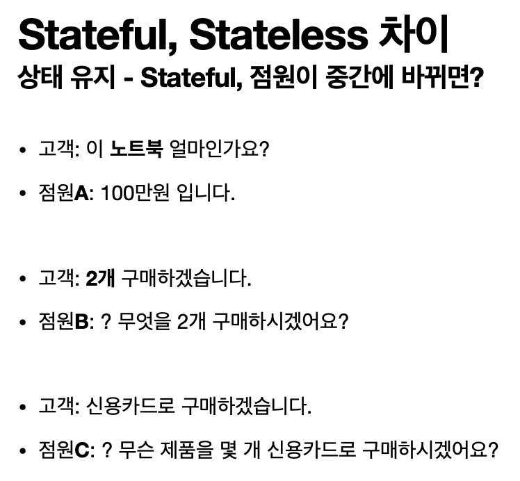
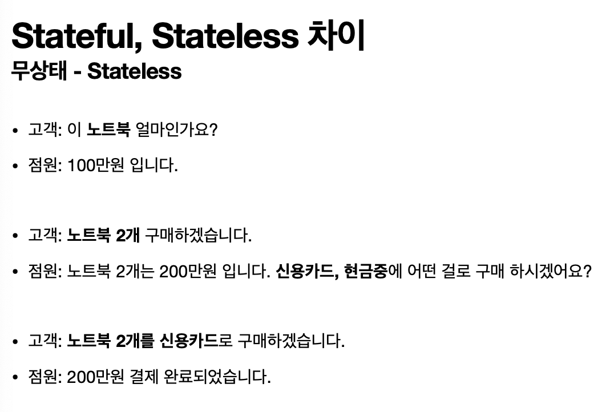

<h1>HTTP(HyperText Transfer Protocol)</h1>
    
TCP : HTTP/1.1, HTTP/2

    
UDP : HTTP/3

    
    <ul>
        <li>클라이언트 서버 구조 : 클라이언트, 서버 역할 자체에만 집중하면 됨</li>
        <li>
            무상태 프로토콜 (Stateless) : 서버가 클라이언트의 상태를 보존하지 않음 
             
            
            <ul>
                <li>stateful에서는 서버가 바뀌면 안됨</li>
                <li>stateless에서는 서버를 쉽게 바꿀 수 있음 => 무한한 서버 증설 가능</li>
            </ul>
        </li>
        <li>비 연결성</li>
    </ul>
    <h2>HTTP Message</h2>
    