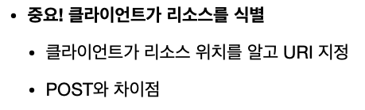

<h2>초보 개발자의 API URI 설계</h2>
    
    <h2>가장 중요한 것은 <strong>리소스</strong>를 식별하는 것이다.</h2>
    
    <h1>회원이 리소스!!</h1>
    
    
URI는 리소스만 식별한다.

    
행위는 http method로 한다!

    
HTTP 메서드 종류

    <ul>
        <li>GET : 리소스 조회</li>
        <li>POST : 요청 데이터 처리, 주로 등록에 사용</li>
        <li>PUT : 리소스를 대체, 해당 리소스가 없으면 생성</li>
        <li>PATCH : 리소스 부분 변경</li>
        <li>DELETE : 리소스 삭제</li>
    </ul>
    <h2>GET</h2>
    
리소스 조회, 서버에 전달하고 싶은 데이터는 query(쿼리 파라미터, 쿼리 스트링)을 통해 전달

    <h2>POST</h2>
    
요청 데이터를 처리, <strong>메시지 바디</strong>를 통해 서버로 요청 데이터 전달

    
서버는 요청 데이터를 처리

    <h2>PUT</h2>
    
리소스를 완전히 대체 (리소스가 존재하면 대체, 없으면 생성)

    
    
POST : /member  .... PUT : /member/100

    <h2>PATCH</h2>
    
리소스 부분 변경

    <h2>DELETE</h2>
    
리소스 제거

    <h2>HTTP 메서드의 속성</h2>
    <h3>1. 안전</h3>
    
호출해도 리소스를 변경하지 않는다.

    <h3>2. 멱등</h3>
    
한 번 호출하든 두 번 호출하든 100번 호출하든 결과가 똑같다.

    
    <h3>3. 캐시 가능</h3>
    
응답 결과 리소스를 캐시해서 사용해도 되는가?

    
GET, HEAD, POST, PATCH 캐시 가능

    
실제로 GET, HEAD 정도만 캐시로 사용
